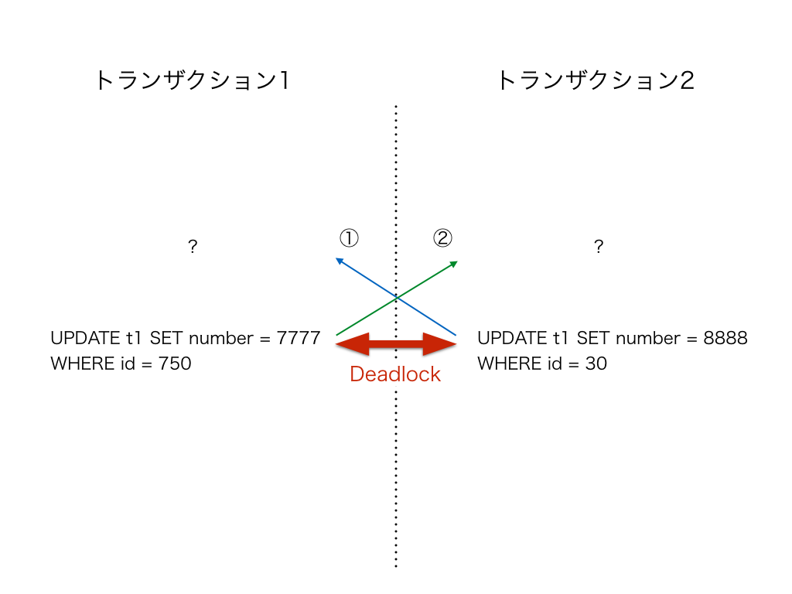
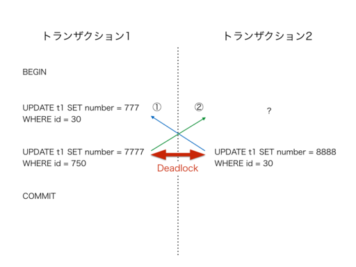

スレッドIDを利用したMySQLのデッドロック解析手法
----

## TL;DR
- `thread_id`を使ってbinlogを調査すればデッドロックが発生したトランザクションの更新クエリがわかる(かも

## 目次
- [はじめに](#はじめに)
- [今回のデッドロック解析手法](#今回のデッドロック解析手法)
- [検証データセット](#検証データセット)
- [1. binlog_format=STATEMENTで検証](#binlog_format=STATEMENTで検証)
- [2. binlog_format=ROWで検証](#binlog_format=ROWで検証)
- [参考資料](#参考資料)

## はじめに
これはMySQL(InnoDB)のログに記録されたthread_idを利用して既に発生したデッドロックの解析手法を紹介する内容である。`show engine innodb status\G`などの`LATEST DETECTED DEADLOCK`だけでは、トランザクション全容の情報に欠け、間接的にデッドロックの原因となったクエリがわからないことがある。そのため、その情報だけでは実際にクエリを発行しているアプリケーションロジック側をどのように修正すればよいのかわからず、解決が難しいという問題がある。今回紹介するthread_idを利用した解析手法では、成功したトランザクション処理を追うことでデッドロック解決に役立つ情報が増えるメリットがある。それとは別に全トランザクション処理のクエリログを収集出来るオプション(general_log)もある。これを有効にすると負荷が大きく、本番稼動している現場のMySQLでは通常はOFFにするため、デッドロック発生時のトランザクション情報は収集出来ない。そのような現場のMySQLでも冗長化のためにレプリケーション構成を取られることが多く、構築過程でbinlogを生成するオプションを有効にするので、今回紹介する解析手法が使える。MySQLのデッドロック解析手法は他でも解説されているが、今のところ日本語の情報でthread_idを利用した方法については述べられてないように思ったので改めて紹介したい。これを利用してデッドロックの原因を突き止め、一つでも多くのトランザクション処理がエラーにならないことを祈る。

## 今回のデッドロック解析手法
1. `show engine innodb status\G`などでデッドロックが発生した`thread_id`を採取  
`innodb_print_all_deadlocks`を使えばエラーログに出力されるので便利
2. トランザクションが成功した`thread_id`を使ってbinlogを検索
3. 対象トランザクションの更新クエリが見えて嬉しい ٩( ᐛ )و

binlogにはSTATEMENT/ROW/MIXEDの3つのフォーマットがあり、見方が微妙に異なる。MIXEDはSTATEMENTとROWの混合のため、今回はSTATEMENTとROWフォーマットの見方を挙げるだけに留める(後述)。binlogにはトランザクション処理が成功した更新クエリしか記録されないため、デッドロックによって失敗した側のトランザクション情報や発行した明示的なロック(SELECT-FOR-UPDATE)なども記録されない(後述)ことに注意が必要である。

## 検証データセット

```bash
#!/bin/bash

cat <<EOF | mysql test
DROP TABLE IF EXISTS t1;
CREATE TABLE t1 (
  id int(11) NOT NULL AUTO_INCREMENT,
  number int(11) DEFAULT NULL,
  PRIMARY KEY (id)
) ENGINE=InnoDB DEFAULT CHARSET=utf8mb4 ROW_FORMAT=DYNAMIC;
EOF

{ echo -n "INSERT INTO t1 (number) VALUES "; echo -n \({1..1000}\) | tr ' ' ','; } | mysql test
```

対象テーブルの行数が少なすぎるとオプティマイザがフルスキャン判断をする場合があるので、行数を多めに用意する。

## binlog_format=STATEMENTで検証
環境
- MySQL-5.6.37
- tx_isolation: REPETABLE-READ
- binlog_format = STATEMENT

検証クエリ。TAとTBの二つのトランザクションでデッドロックさせる
```sql
TA> BEGIN;
TB> BEGIN;
TA> UPDATE t1 SET number = 777 WHERE id = 30;
TB> UPDATE t1 SET number = 888 WHERE id = 750;
TA> UPDATE t1 SET number = 7777 WHERE id = 750; // 待たされる
TB> UPDATE t1 SET number = 8888 WHERE id = 30; // deadlock 
TA> COMMIT;
```

余談だが、
https://dev.mysql.com/doc/refman/5.6/ja/innodb-deadlock-detection.html
> InnoDB では、自動的にトランザクションのデッドロックが検出され、デッドロックを解除するためにトランザクション (複数の場合あり) がロールバックされます。InnoDB は、小さいトランザクションを選択してロールバックしようと試みます。トランザクションのサイズは、挿入、更新、または削除された行数によって決定されます。

なので、先に待たされているクエリ側が成功するとは限らない。 

以下はdeadlockになった直後に`show engine innodb status\G`を実行して`LATEST DETECTED DEADLOCK`だけを抜粋したログ。

```
------------------------
LATEST DETECTED DEADLOCK
------------------------
2018-03-23 19:09:38 7f2eddd75700
*** (1) TRANSACTION:
TRANSACTION 3846, ACTIVE 18 sec starting index read
mysql tables in use 1, locked 1
LOCK WAIT 3 lock struct(s), heap size 1184, 2 row lock(s), undo log entries 1
MySQL thread id 2, OS thread handle 0x7f2edddb6700, query id 34 localhost root updating
UPDATE t1 SET number = 7777 WHERE id = 750
*** (1) WAITING FOR THIS LOCK TO BE GRANTED:
RECORD LOCKS space id 6 page no 5 n bits 624 index `PRIMARY` of table `test`.`t1` trx id 3846 lock_mode X locks rec but not gap waiting
Record lock, heap no 475 PHYSICAL RECORD: n_fields 4; compact format; info bits 0
 0: len 4; hex 800002ee; asc     ;;
 1: len 6; hex 000000000f07; asc       ;;
 2: len 7; hex 07000001400110; asc     @  ;;
 3: len 4; hex 80000378; asc    x;;

*** (2) TRANSACTION:
TRANSACTION 3847, ACTIVE 11 sec starting index read
mysql tables in use 1, locked 1
3 lock struct(s), heap size 1184, 2 row lock(s), undo log entries 1
MySQL thread id 7, OS thread handle 0x7f2eddd75700, query id 35 localhost root updating
UPDATE t1 SET number = 8888 WHERE id = 30
*** (2) HOLDS THE LOCK(S):
RECORD LOCKS space id 6 page no 5 n bits 624 index `PRIMARY` of table `test`.`t1` trx id 3847 lock_mode X locks rec but not gap
Record lock, heap no 475 PHYSICAL RECORD: n_fields 4; compact format; info bits 0
 0: len 4; hex 800002ee; asc     ;;
 1: len 6; hex 000000000f07; asc       ;;
 2: len 7; hex 07000001400110; asc     @  ;;
 3: len 4; hex 80000378; asc    x;;

*** (2) WAITING FOR THIS LOCK TO BE GRANTED:
RECORD LOCKS space id 6 page no 4 n bits 624 index `PRIMARY` of table `test`.`t1` trx id 3847 lock_mode X locks rec but not gap waiting
Record lock, heap no 31 PHYSICAL RECORD: n_fields 4; compact format; info bits 0
 0: len 4; hex 8000001e; asc     ;;
 1: len 6; hex 000000000f06; asc       ;;
 2: len 7; hex 060000013f0110; asc     ?  ;;
 3: len 4; hex 80000309; asc     ;;

*** WE ROLL BACK TRANSACTION (2)
```

実際にデッドロックが発生した`(1) TRANSACTION`と`(2) TRANSACTION`のクエリ情報が出力されており、トランザクション1のスレッド情報は`MySQL thread id 2`, トランザクション2は`MySQL thread id 7`である。また、`WE ROLL BACK TRANSACTION (2)`とあるように、ロールバックされたのはトランザクション2なので、少なくともbinlogにはトランザクション2(thread_id=7)のログは残らない。トランザクション1がCOMMITされていればbinlogに残るため、それを期待して`thread_id=2`かつデッドロック発生時刻`2018-03-23 19:09:38`前後のトランザクションログをbinlog内で検索する。

binlog内のトランザクションログ。
```
# at 120
#180323 19:09:20 server id 1004003039  end_log_pos 199 CRC32 0xbcd78d4c         Query   thread_id=2     exec_time=0     error_code=0
SET TIMESTAMP=1521799760/*!*/;
SET @@session.pseudo_thread_id=2/*!*/;
SET @@session.foreign_key_checks=1, @@session.sql_auto_is_null=0, @@session.unique_checks=1, @@session.autocommit=1/*!*/;
SET @@session.sql_mode=1575485472/*!*/;
SET @@session.auto_increment_increment=1, @@session.auto_increment_offset=1/*!*/;
/*!\C latin1 *//*!*/;
SET @@session.character_set_client=8,@@session.collation_connection=8,@@session.collation_server=45/*!*/;
SET @@session.lc_time_names=0/*!*/;
SET @@session.collation_database=DEFAULT/*!*/;
BEGIN
/*!*/;
# at 199
#180323 19:09:20 server id 1004003039  end_log_pos 313 CRC32 0x45491d66         Query   thread_id=2     exec_time=0     error_code=0
use `test`/*!*/;
SET TIMESTAMP=1521799760/*!*/;
UPDATE t1 SET number = 777 WHERE id = 30
/*!*/;
# at 313
#180323 19:09:33 server id 1004003039  end_log_pos 429 CRC32 0xc7f885c6         Query   thread_id=2     exec_time=5     error_code=0
SET TIMESTAMP=1521799773/*!*/;
UPDATE t1 SET number = 7777 WHERE id = 750
/*!*/;
# at 429
#180323 19:09:50 server id 1004003039  end_log_pos 460 CRC32 0x16dd33eb         Xid = 28
COMMIT/*!*/;
DELIMITER ;
# End of log file
ROLLBACK /* added by mysqlbinlog */;
/*!50003 SET COMPLETION_TYPE=@OLD_COMPLETION_TYPE*/;
/*!50530 SET @@SESSION.PSEUDO_SLAVE_MODE=0*/;
```

`show engine innodb status\G`の`LATEST DETECTED DEADLOCK`ではトランザクション1で`UPDATE t1 SET number = 7777 WHERE id = 750`が実行されたログしかなかったが、binlogからはそのクエリより前に実行された`UPDATE t1 SET number = 777 WHERE id = 30`がログに残されている。

### thread-idを使った調査前  


### thread-idを使った調査後  


以上より、トランザクション2側のロック待ち①はトランザクション1側の`UPDATE t1 SET number = 777 WHERE id = 30`が直接的な原因である、という仮説が立てられるようになる。失敗したトランザクション2はbinlogに残らないため、トランザクション1側のロック待ち②については不明瞭なままである。  
また、binlogには成功したトランザクション処理、さらには更新系クエリのログしか記録されない。そのため、次のような参照の明示的なロック獲得はthread_idを利用した解析方法では追うことが出来ない。

```sql
TA> BEGIN;
TB> BEGIN;
TA> SELECT * FROM t1 WHERE id = 1 FOR UPDATE;
TB> SELECT * FROM t1 WHERE id = 300 FOR UPDATE;
TA> SELECT * FROM t1 WHERE id = 300 FOR UPDATE; // 待たされる
TB> SELECT * FROM t1 WHERE id = 1 FOR UPDATE; // deadlock
TA> COMMIT;
```

## binlog_format=ROWで検証
環境
- MySQL-5.6.37
- tx_isolation: REPETABLE-READ
- binlog_format = ROW

```sql
TA> BEGIN;
TB> BEGIN;
TA> UPDATE t1 SET number = 999 WHERE id = 1;
TB> UPDATE t1 SET number = 222 WHERE id = 500;
TA> UPDATE t1 SET number = 9999 WHERE id = 500; // 待たされる
TB> UPDATE t1 SET number = 2222 WHERE id = 1; // deadlock
TA> COMMIT;
```

続いて`binlog_format=ROW`でも同様に解析する。

```
------------------------
LATEST DETECTED DEADLOCK
------------------------
2018-03-23 22:28:17 7f602aec6700
*** (1) TRANSACTION:
TRANSACTION 4361, ACTIVE 17 sec starting index read
mysql tables in use 1, locked 1
LOCK WAIT 3 lock struct(s), heap size 1184, 2 row lock(s), undo log entries 1
MySQL thread id 2, OS thread handle 0x7f602af07700, query id 37 localhost root updating
UPDATE t1 SET number = 9999 WHERE id = 500
*** (1) WAITING FOR THIS LOCK TO BE GRANTED:
RECORD LOCKS space id 6 page no 5 n bits 624 index `PRIMARY` of table `test`.`t1` trx id 4361 lock_mode X locks rec but not gap waiting
Record lock, heap no 225 PHYSICAL RECORD: n_fields 4; compact format; info bits 0
 0: len 4; hex 800001f4; asc     ;;
 1: len 6; hex 00000000110a; asc       ;;
 2: len 7; hex 09000001420110; asc     B  ;;
 3: len 4; hex 800000de; asc     ;;

*** (2) TRANSACTION:
TRANSACTION 4362, ACTIVE 12 sec starting index read
mysql tables in use 1, locked 1
3 lock struct(s), heap size 1184, 2 row lock(s), undo log entries 1
MySQL thread id 3, OS thread handle 0x7f602aec6700, query id 38 localhost root updating
UPDATE t1 SET number = 2222 WHERE id = 1
*** (2) HOLDS THE LOCK(S):
RECORD LOCKS space id 6 page no 5 n bits 624 index `PRIMARY` of table `test`.`t1` trx id 4362 lock_mode X locks rec but not gap
Record lock, heap no 225 PHYSICAL RECORD: n_fields 4; compact format; info bits 0
 0: len 4; hex 800001f4; asc     ;;
 1: len 6; hex 00000000110a; asc       ;;
 2: len 7; hex 09000001420110; asc     B  ;;
 3: len 4; hex 800000de; asc     ;;

*** (2) WAITING FOR THIS LOCK TO BE GRANTED:
RECORD LOCKS space id 6 page no 4 n bits 624 index `PRIMARY` of table `test`.`t1` trx id 4362 lock_mode X locks rec but not gap waiting
Record lock, heap no 2 PHYSICAL RECORD: n_fields 4; compact format; info bits 0
 0: len 4; hex 80000001; asc     ;;
 1: len 6; hex 000000001109; asc       ;;
 2: len 7; hex 08000001410110; asc     A  ;;
 3: len 4; hex 800003e7; asc     ;;

*** WE ROLL BACK TRANSACTION (2)
```

`binlog_format=ROW`の場合は、更新クエリに対するmysqlbinlogコマンドでオプションを指定(--verbose)すればbase64でエンコードされた差分内容の擬似SQLを出力するのでそれを利用する。`WE ROLL BACK TRANSACTION (2)`とあるので、トランザクション1の`thread_id=2`とデッドロック時刻`2018-03-23 22:28:17`周辺のbinlog内を検索する。

```
# at 120
#180323 22:28:00 server id 1004003039  end_log_pos 192 CRC32 0x7eb7cd6c         Query   thread_id=2     exec_time=0     error_code=0
SET TIMESTAMP=1521811680/*!*/;
SET @@session.pseudo_thread_id=2/*!*/;
SET @@session.foreign_key_checks=1, @@session.sql_auto_is_null=0, @@session.unique_checks=1, @@session.autocommit=1/*!*/;
SET @@session.sql_mode=1575485472/*!*/;
SET @@session.auto_increment_increment=1, @@session.auto_increment_offset=1/*!*/;
/*!\C latin1 *//*!*/;
SET @@session.character_set_client=8,@@session.collation_connection=8,@@session.collation_server=45/*!*/;
SET @@session.lc_time_names=0/*!*/;
SET @@session.collation_database=DEFAULT/*!*/;
BEGIN
/*!*/;
# at 192
#180323 22:28:00 server id 1004003039  end_log_pos 238 CRC32 0x850ffe6c         Table_map: `test`.`t1` mapped to number 70
# at 238
#180323 22:28:00 server id 1004003039  end_log_pos 292 CRC32 0x24cf6e02         Update_rows: table id 70 flags: STMT_END_F

BINLOG '
4AC1WhPf3tc7LgAAAO4AAAAAAEYAAAAAAAEABHRlc3QAAnQxAAIDAwACbP4PhQ==
4AC1Wh/f3tc7NgAAACQBAAAAAEYAAAAAAAEAAgAC///8AQAAAAEAAAD8AQAAAOcDAAACbs8k
'/*!*/;
### UPDATE `test`.`t1`
### WHERE
###   @1=1 /* INT meta=0 nullable=0 is_null=0 */
###   @2=1 /* INT meta=0 nullable=1 is_null=0 */
### SET
###   @1=1 /* INT meta=0 nullable=0 is_null=0 */
###   @2=999 /* INT meta=0 nullable=1 is_null=0 */
# at 292
#180323 22:28:11 server id 1004003039  end_log_pos 338 CRC32 0xf1e2f726         Table_map: `test`.`t1` mapped to number 70
# at 338
#180323 22:28:11 server id 1004003039  end_log_pos 392 CRC32 0x7d577b97         Update_rows: table id 70 flags: STMT_END_F

BINLOG '
6wC1WhPf3tc7LgAAAFIBAAAAAEYAAAAAAAEABHRlc3QAAnQxAAIDAwACJvfi8Q==
6wC1Wh/f3tc7NgAAAIgBAAAAAEYAAAAAAAEAAgAC///89AEAAPQBAAD89AEAAA8nAACXe1d9
'/*!*/;
### UPDATE `test`.`t1`
### WHERE
###   @1=500 /* INT meta=0 nullable=0 is_null=0 */
###   @2=500 /* INT meta=0 nullable=1 is_null=0 */
### SET
###   @1=500 /* INT meta=0 nullable=0 is_null=0 */
###   @2=9999 /* INT meta=0 nullable=1 is_null=0 */
# at 392
#180323 22:28:28 server id 1004003039  end_log_pos 423 CRC32 0x06cb62d3         Xid = 30
COMMIT/*!*/;
DELIMITER ;
# End of log file
```

`binlog_format=STATEMENT`と少し異なるがthread_idはトランザクション開始地点(at 120)に記録されている。直近のCOMMITまでのログに異なるthread_idの差分内容が突然混ざることはないはず(要出典)なので、解析は可能である。  
ただし、先に挙げたSELECT-FOR-UPDATEによる明示的なロックによるデッドロックと、変更差分がないような更新クエリは`binlog_format=ROW`ではログに出力されない。特に後者はROWのみに発生するため、注意が必要である。

## 参考資料
- Percona Database Performance Blog (2014) - [How to deal with MySQL deadlocks](https://www.percona.com/blog/2014/10/28/how-to-deal-with-mysql-deadlocks/)